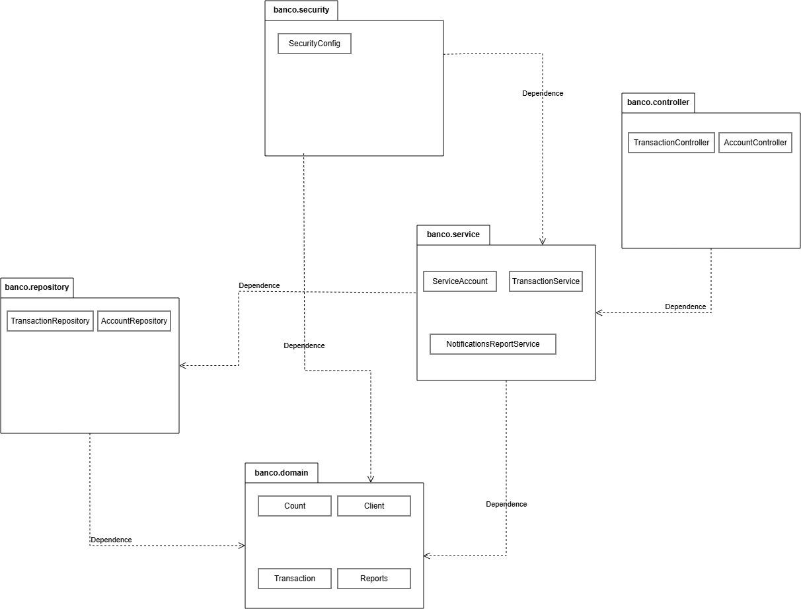
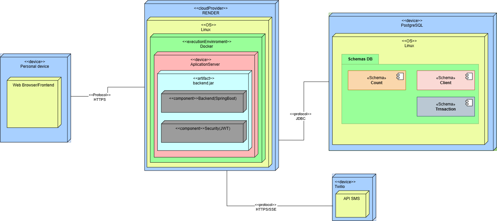
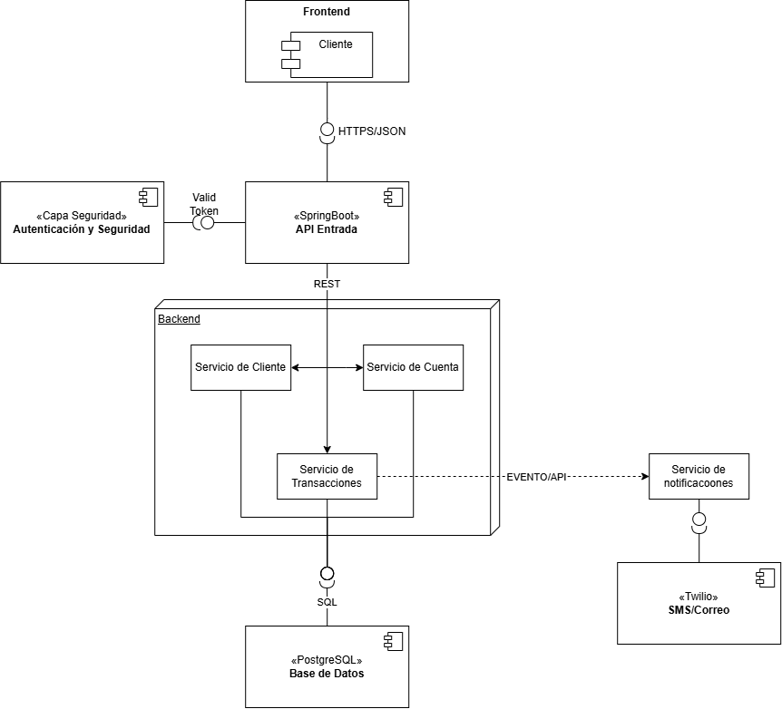

# ARQ-EAV08-2026-2
Repositorio para entregables propios de la materia de Arquitectura de Software del equipo avanzado 8 de la edición 26-2 de CodeF@ctory, equipo conformado por:

YEPES JARAMILLO ANGEL SIMON: angel.yepes2@udea.edu.co
CONTRERAS PUELLO SAMUEL ESTEBAN: samuel.contreras@udea.edu.co
ALBORNOZ VILLADIEGO JOSÉ FERNANDO: jose.albornoz@udea.edu.co

# Contexto:

## Contexto de negocio
Las regulaciones de open banking impulsan la apertura de los sistemas financieros para que terceros desarrollen nuevos servicios a partir de información bancaria, siempre con el consentimiento del usuario. Para habilitar este ecosistema, las instituciones financieras deben ofrecer APIs que permitan a aplicaciones externas consultar información y ejecutar ciertas operaciones de forma controlada.

## Problema a resolver
BackendBank busca ser la capa tecnológica que expone servicios bancarios mediante APIs seguras, permitiendo que aplicaciones externas interactúen con ellos bajo reglas claras de acceso y trazabilidad.

## Alcance funcional
- **Registro de aplicaciones externas** .
- **Gestión de credenciales y autenticación** .
- **Exposición de APIs** .
- **Control de permisos y consentimiento** .
- **Registro de solicitudes** .
- **Reportes** .

## Estado actual
El módulo implementado es la **gestión de clientes**, base para el resto de la plataforma:
- Registro de clientes (`POST /clientes`)
- Ingreso con validación de credenciales y estado (`POST /clientes/ingreso`)
- Actualización de datos por un administrador (`PUT /clientes/{id}`)
- Cambio de estado activo/inactivo por un administrador (`PATCH /clientes/{id}/estado`)

Incluye roles (`CLIENTE`, `ADMINISTRADOR`) y estados (`activo`, `inactivo`, `bloqueado`, `pendiente_de_validacion`).
  
Este módulo corresponde a las hu's comprometidas en el sprint 1 que fueron:
- Registrar un nuevo cliente
- Actualizar datos del perfil de un cliente
- Cambiar el estado de un cliente (activo/inactivo)
- Autenticarse en el sistema
- Restringir acciones según el rol del usuario
  
Se debe contemplar algunas recomendaciones que nos hicieron en la review como el manejo de las contraseñas de los clientes que es algo que esta planteado corregirse para el sprint2

En el siguiente video se puede ver como funciona el back que realizamos y como las ejecuciones se reflejan correctamente en la bd:
https://drive.google.com/file/d/1mA1mIw5pobcbCp0FEJ88T2emUkaHuXbK/view?usp=sharing

## Previsto para el sprint 2
Las historias de usuario del sprint 2 se definirán en la próxima planning.
También se corregirá el manejo de las contraseñas de los clientes, recomendación de la review del sprint 1.
Si el tiempo del sprint alcanza, se aplicarán las enseñanzas vistas a lo largo del semestre.
---
# Diagrama de paquetes

---
# Diagrama de despliegue

---

# Diagrama de componentes

---
# ADRs
## ADR-001: Monolito en capas con servicios separados por responsabilidad

**Estado:** Aceptado

**Contexto:** BackendBank debe exponer APIs bancarias. En el sprint 1 solo existe la gestión de clientes. Se buscó el mismo modelo de capas y servicios que se usa ahora,
con el servicio apartado del controlador y de la persistencia, pero desplegado dentro de un solo proceso.

**Decisión:** Una sola aplicación Spring Boot (`backendbank`) y una sola base PostgreSQL. El módulo `cliente` queda en tres capas:

- API: `ClienteController`, los records de request/response y `ApiExceptionHandler`
- Servicio: `ClienteService`
- Persistencia: `Cliente` y `ClienteRepository`

El controlador no accede a la base. Llama al servicio, y el servicio llama al repositorio.

**Consecuencias:** El despliegue es un solo artefacto y las operaciones de un caso de uso quedan en una transacción. 
El servicio puede extraerse después sin reescribir las reglas. 
El riesgo es que `ClienteService` concentre demasiado cuando entren credenciales, permisos y reportes.

## ADR-002: PostgreSQL con JPA y esquema fuera de la aplicación

**Estado:** Aceptado

**Contexto:** Los clientes, sus credenciales y su estado tienen que persistir con unicidad de documento, email y usuario.
El esquema no debe cambiar solo porque arranque la aplicación.

**Decisión:** Spring Data JPA contra PostgreSQL. 
En `application.properties`, `spring.jpa.hibernate.ddl-auto=none` y `spring.jpa.open-in-view=false`. 
La entidad `Cliente` mapea la tabla `clientes`. El id es un UUID asignado en `@PrePersist`. 
La unicidad se valida en `ClienteService` y, si la base rechaza el insert, `DataIntegrityViolationException` se traduce a `ClienteDuplicadoException`. 
Los tests usan H2.

**Consecuencias:** El esquema se controla aparte del código y Hibernate no genera DDL en runtime.
Cada request no mantiene una sesión JPA abierta. 
Hay dos chequeos de duplicado (servicio y restricción de la base) para cubrir la condición de carrera.

## ADR-003: Autorización por rol en el servicio y errores de dominio en el borde HTTP

**Estado:** Aceptado

**Contexto:** Actualizar un cliente y cambiar su estado son acciones de administrador. El ingreso depende del estado de la cuenta.
En este sprint no hay un servidor de identidad aparte.

**Decisión:** La identidad del actor viaja como el UUID `actualizadoPor`. `ClienteService.exigirAdministrador` exige que ese cliente exista, esté `activo` y tenga rol `ADMINISTRADOR`.
Quien se registra queda con rol `CLIENTE` y estado `activo`.
Las reglas de negocio lanzan excepciones de dominio (`AccesoDenegadoException`, `ClienteDuplicadoException`, `CredencialesInvalidasException`, entre otras) y `ApiExceptionHandler` 
las convierte en 400, 401, 403, 404 o 409. Los datos de entrada se validan con Jakarta Validation en el controlador.

**Consecuencias:** Las reglas de acceso quedan junto al caso de uso y la API responde siempre con el mismo formato de error. No hay token ni sesión: quien conozca el UUID de un administrador puede ejecutar la acción. La contraseña se guarda y se compara en texto plano; la review del sprint 1 dejó eso para corregirlo en el sprint 2.

